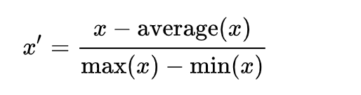
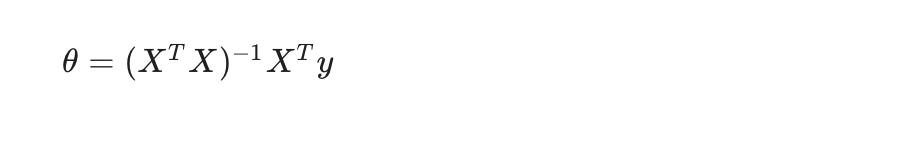

# Artifical Intelligence

## 1-WEEK

### 기계학습의 정의

• Arthur Samuel(1959)

MachineLearning: Fieldof study that gives computers the ability to learn without being explicitly programmed.

• Tom Mitchell(1998)

Well-posedLearning Problem: A computer program is said to learn from experience E with respect to some task T and some performance measure P, if its performance on T, as measured by P, improves with experience E.

=> E에 의해서 T를 수행하는 P가 개선될 수 있다.

T = 컴퓨터 프로그램의 작업
E = 작업과 관련된 경험
P = 작업 수행 성능

### 기계학습의 분류

• 지도 학습
  - 입력 데이터와 출력 데이터 format이 정해져 있음 
  (회귀 - Linear Regression, 분류 - SVD벡터)
  
• 비지도 학습(자율학습)
  - 새로운 데이터 구조를 도출
  (Clustering, Non-clustering)

### 기계학습 대표모델(선형회귀)과 비용함수

함수 h : X → Y를 배우기 위한 학습문제. 
우리가 예측하려는 목표 변수가 연속적이면 학습 문제를 회귀 문제, 그렇지 않고 이산적인 값을 예측한다면 분류 문제라고합니다.

가설함수 : 주어진 데이터 Set에 대해 아래와 같은 선형함수를 예측하는 것

비용함수 : Cost Function은 입력한 Training Set에 대하여 가장 적합한 직선을 가질 수 있게 해줍니다. 
(ℎ𝜃=𝜃0+𝜃1𝑥, 𝜃의 값들에 따라 함수의 개형이나 값이 아래의 그림처럼  달라지기 때문에 가장 𝑦 에 근사하도록 Training Set을 통해서 정해주어야합니다.)

근사를 위한 비용함수 공식

비용함수를 통해서 입력된 데이터Set에 대한 가설함수의 정확성을 측정할 수 있습니다.
(오차가 가장 작은 𝜃를 구해서 가설함수를 예측하는 것이 핵심)

위의 경우보다 복잡한 𝜃0,𝜃1를 가지는 경우에는 가설함수가 아래와 같이 등고선 모양을 보입니다.

2차원 등고선 그래프의 최소지점을 찾기위해 "기울기하강"알고리즘이 필요합니다. 

### "기울기하강"알고리즘의 이해
주어진 가설함수에 대해서 데이터에 가장 잘 부합하는 𝜃값을 찾기위해 "기울기하강"알고리즘을 사용해야합니다. 

기울기하강 알고리즘:

주어진 α는 훈련비율이며("기울기하강"의 정도), 미분계수는 좌표점의 오차를 보정(최소지점의 탐색)합니다.
선형회귀 모델에서는 전역적인 최소지점이 한개만 도출됩니다.

## 2-WEEK

### 다변량 선형 회귀 모델

예측, 분류를 위해서 다수의 feature가 필요할 수 있습니다. 

다변량이 적용된 “기울기 하강”알고리즘은 반복적으로 알고리즘을 수행해야 합니다. 
변수가 증가함에 따라서 만들어지는 3차원 모델은 매우 복잡할 수 있습니다. 
 

위와 같은 경우 반복적으로 “기울기 하강”알고리즘을 적용해서 최저값을 찾으면 매우 느리게 
동작할 수 있습니다. 이를 위해서 평균정규화(Feature Scaling)를 수행해야합니다.

### Feature Scaling
 

표준편차 혹은 최대 및 최소 가중치의 차이로 나누어 3차원 모델을 단순화 시킵니다. 
이를 통해서 “기울기 하강”알고리즘을 적용시 더 빠르게 최저점을 찾을 수 있습니다.
또한 최저점을 올바르게 탐색하기 위해서는 적당한 값의 훈련 비율을 적용해야 합니다.

### Features and Polynomial Regression
가설함수는 다항식과 같은 형태로도 그려질 수 있습니다. 이와 같은 경우 두가지 방법을 통해 함수를 도출합니다.

- feature간의 특성을 조합해서 새로운 feature를 만든다.
- 적절한 feature를 선택해서 가설함수를 그린다. 

### Normal Equation
 
다수의 feature를 반복적으로 계산하지 않고도 최저점을 구해내는 방식입니다.
Vector의 표현을 통해서 짧은 시간내에 연산을 완료합니다.

<차이점>
 

## 3-WEEK

